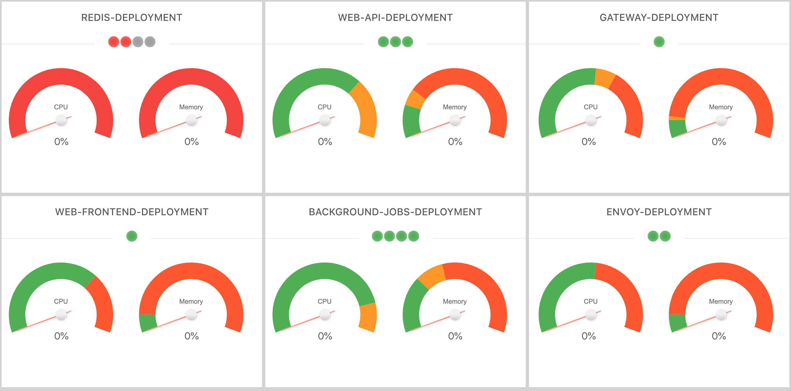

## Kubex

[](https://travis-ci.org/jawahars16/kubex)
[](https://goreportcard.com/report/github.com/jawahars16/kubex)

Kubex is a simple and lightweight dashboard to monitor kubernetes cluster state and resources. 



### Installation

Install via go get command.

```
go get -u github.com/jawahars16/kubex
```

Note: Homebrew installation is planned.

### Getting Started

To watch the state and resources (CPU and memory) of all your services

```
kubex watch [resource] [--port port_number] [--namespace cluster_namespace]
```

Example

```
kubex watch service --port 5000 --namespace dallas_team
```

Use ```--all-namespaces``` flag to watch resources from all namespaces. Kubex support watching service, node and deployments for now.

### Prerequisites

Kubex reads cluster information from default kube config file($HOME/.kube/config). Before start watching the state using kubex, make sure you set a context entry in kubeconfig.

```
kubectl config set-context NAME [--cluster=cluster_nickname] [--user=user_nickname] [--namespace=namespace]
```

[Read here for more details about setting a context entry](http://jamesdefabia.github.io/docs/user-guide/kubectl/kubectl_config_set-context/)

## Built With

* [React](https://reactjs.org/) - Building user interfaces
* [godep](https://github.com/tools/godep) - Dependency toolt for go
* [client-go](https://github.com/kubernetes/client-go) - Used to fetch data from kubernetes cluster
* [Ant design](https://ant.design/) - UI Design library for react

## License

This project is licensed under the MIT License - see the [LICENSE.md](LICENSE.md) file for details
